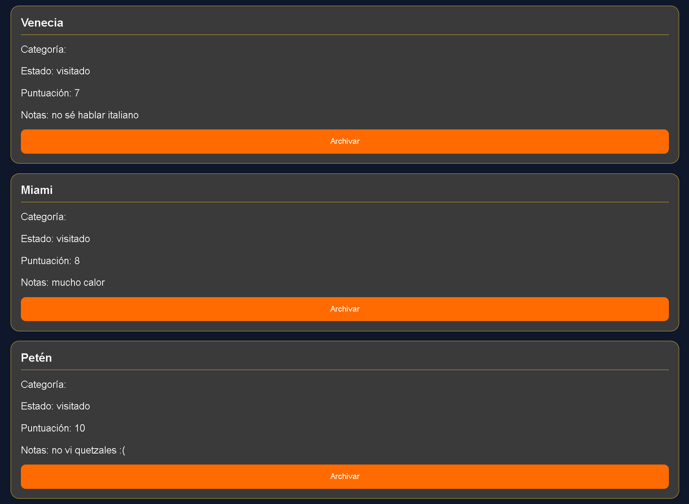

📌 Proyecto final Web

🧾 Descripción

Proyecto final de sistemas y tecnologías web sobre un diario de registro de viajes

🛠️ Herramientas utilizadas

React

Vite

Docker

Express

postgreSQL

### Librerías

react

crypto

### Deploy

Vercel

Render

▶️ Instrucciones para ejecutar el proyecto
1. Clonar repositorio
git clone http://github.com/JAVIERCLO/proyectoFinalWeb/tree/fase3
2. Entrar al proyecto
cd proyectoFinalWeb
3. Instalar dependencias
npm install
4. Ejecutar el proyecto
npm run dev (frontend)
docker-compose up --build (backend + base de datos)

👥 Integrantes

Javier Chávez

### Mis primeros Items

Explicación de paleta de colores:
## Tema claro:
- Fondo principal: `#FFE69B` - Amarillo arena
- Superficie / Cards: `#F5F5F5` - Blanco humo
- Texto principal: `#121212` - negro carbón
- Color de acento: `#FF6B00` - naranja vibrante
- Color de detalles: `#D4AF37` - dorado clásico

El amarillo recuerda a la arena de la playa, y la combinación del fondo amarillo con las cards fondo blanco recuerdan a las postales de viaje de muchos lugares turísticos, el texto negro hace que sea muy fácil leer porque ya estamos acostumbrados a leer negro sobre blanco, el naranja representa energía y aventura, ideal para una página web de viajes, y se utilizó dorado para los detalles en los input boxes porque se asocia el dorado con lujo, y negro para generar sombra y contraste al hacer hover sobre las cards para simular un pequeño efecto 3D.

---

## Tema oscuro
- Fondo principal: `#0F172A` - Azul oscuro
- Superficie / Cards: `#3A3A3A` - gris grafito
- Texto principal: `#F5F5F5` - blanco suave
- Color de acento: `#FF6B00` - naranja vibrante
- Color de detalles: `#D4AF37` - dorado clásico

El azul oscuro se utiliza en muchas páginas de cruceros y hoteles de lujo porque transmite calma y seguridad, para las cards se usa la combinación de gris con detalles dorados porque transmite elegancia y lujo, las letras se cambian a blanco porque en muchas apps en modo oscuro se utiliza así, y ya estamos acostumbrados a ello. y se repite el dorado que transmite energía y aventura que recuerda a lo vivido en los viajes.

### Mi gráfica original
Elegí una gráfica en forma de radar que presenta las puntuaciones promedio de cada categoría, la elegí porque me gusta mucho cómo se ven este tipo de gráficas en juegos que he jugado como FIFA, además, me parece valioso ver qué categorías tienen mejores puntuaciones porque pueden ayudar a tomar desiciones sobre el próximo viaje, y en un gráfico de radar es fácil ver todas las categorías en el mismo lugar sin tener que mover mucho los ojos.

### Mis 3 desiciones técnicas
Estructura del reducer: Utilicé como base el código proporcionado en la página del proyecto, que incluye las acciones: HIDRATAR, AGREGAR, ELIMINAR, CAMBIAR_ESTADO, FILTRAR, LIMPIAR_FILTROS. Así que solamente fue necesario agregar la acción de registrar actividad, que interactará con la tabla Registros de la base de datos para modificar el historial del item.

Acción más difícil de implementar: Gracias a que pude reciclar la mayoría del código proporcionado, la acción más difícil de implementar fue Registrar actividad, sin embargo, pude basarme en las demás acciones para que la lógica de cambiar el estado se mantenga, pero fue necesario lograr que interactúe con la estructura creada dentro del item y no directamente con la lista principal.

Gráfica más compleja,  qué datos transforma y cómo: La gráfica de puntuación por categoría. Esta no usa los datos directamente como las otras, sino que primero se necesita agrupar los items por categoría usando categoriaID. Después de esto se deben filtrar los que tienen una puntuación válida y calcular el promedio de la puntuación de cada categoría. Después de esto se transforman al formato que pide Recharts. Elegí esta gráfica porque en un solo lugar se puede ver la puntuación para todas las categorías, además de que me gusta mucho visualmente este tipo de gráficas porque las he visto en videojuegos que he jugado antes.

---

## Hooks utilizados

| Hook | Archivo | Propósito |
|--------|--------|--------|
| useLocalStorage | src/hooks/useLocalStorage.js | Sincroniza el estado de React con LocalStorage para persistir configuraciones entre sesiones. Se utiliza para almacenar el tema seleccionado y el modo de almacenamiento. |
| useFetch | src/hooks/useFetch.js | Realiza peticiones HTTP GET utilizando Fetch API, gestionando automáticamente los estados de carga, error y datos obtenidos. Incluye AbortController para cancelar solicitudes pendientes. |
| useAtajoTeclado | src/hooks/useAtajoTeclado.js | Permite registrar atajos de teclado reutilizables con limpieza automática de listeners. Se utiliza para los atajos Ctrl + I (cambio de tema) y Ctrl + N (enfoque del formulario). |
| useCategoriaFavorita | src/hooks/useCategoriaFavorita.js | Hook de dominio específico para Travel Tracker. Analiza los Items registrados y determina automáticamente la categoría de viaje más frecuente del usuario. |

